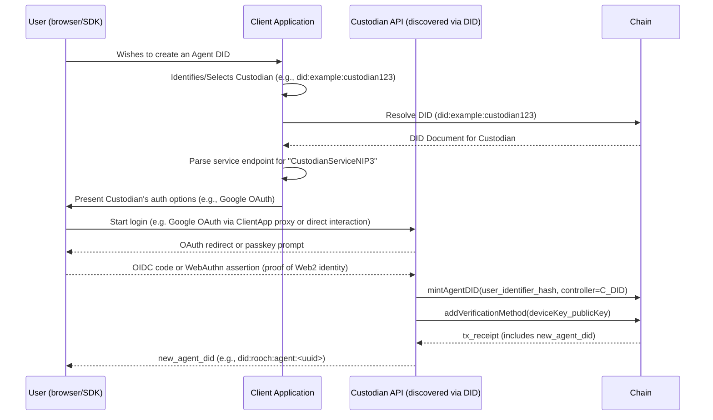

## Abstract

*NIP-3* specifies an off-chain **Delegated-Control Protocol** that allows Web2 users to create AI Agent DIDs (as defined in NIP-1) without directly holding a crypto wallet. A *Custodian* is a service, discoverable via its DID document, that temporarily controls the `controller` field of a freshly minted Agent DID. Custodians offer one or more Web2 authentication methods (e.g., Google OAuth, Passkey) to facilitate this process. Users may later replace the custodian with another service or with their own wallet via a single DID document update.

## Motivation

| Pain point | Effect | Solution offered by NIP-3 |
|------------|--------|---------------------------|
| Web2 users have **no crypto wallet** | Cannot sign the on-chain DID-creation tx | Custodian does it on their behalf after Web2 authentication |
| Users need **flexibility in choosing custodians** | Avoid vendor lock-in | Custodians are discoverable via their DIDs, allowing for a competitive ecosystem |
| Users need to **migrate** later | Maintain DID continuity | `controller` field can be switched in one tx |

## Specification

### Custodian Service Declaration in DID Document

Custodians declare their services as part of their DID document (NIP-1) using the `service` property. This allows clients to discover and interact with Custodian services in a decentralized manner.

Each Custodian service endpoint in the DID document's `service` array MUST include:
*   `id`: A URI that conforms to the DID Core specification, typically a fragment identifier relative to the Custodian's DID (e.g., `did:example:custodian123#custodian-service`).
*   `type`: A string identifying the type of service. For NIP-3 Custodian services, this MUST be `CustodianServiceNIP3`.
*   `serviceEndpoint`: A URI specifying the HTTPS base URL for the Custodian's API.
*   `metadata`: An optional JSON object containing additional information about the service, such as:
    *   `name`: (String) A human-readable name for the Custodian service.
    *   `auth_methods`: (array of u16) An array of numeric codes representing the Web2 login methods supported by the Custodian (see `auth_methods` enumeration below).

**Example DID Document Snippet for a Custodian:**

```json
{
  "@context": "https://www.w3.org/ns/did/v1",
  "id": "did:example:custodian123",
  // ... other DID document properties like verificationMethod, authentication, etc. ...
  "service": [
    {
      "id": "did:example:custodian123#custodian-service",
      "type": "CustodianServiceNIP3",
      "serviceEndpoint": "https://custodian.example.com/api",
      "metadata": {
        "name": "Example Custodian Inc.",
        "auth_methods": [1, 7] // Supports Google OAuth and WebAuthn Passkey
      }
    }
    // ... other services offered by the DID subject ...
  ]
}
```

Clients discover Custodians by resolving their DIDs and looking for service entries with `type: "CustodianServiceNIP3"`. The `serviceEndpoint` URI is then used to interact with the Custodian's API as defined in the "Delegated-Control Protocol".

### `auth_methods` enumeration

| Code  | Login method     | Protocol reference |
| ----- | ---------------- | ------------------ |
| `1`   | Google OAuth     | OIDC               |
| `2`   | Twitter OAuth    | OAuth 2            |
| `3`   | Apple Sign-In    | JWT                |
| `4`   | GitHub OAuth     | OAuth 2            |
| `5`   | Email OTP        | RFC 6120           |
| `6`   | SMS OTP          | —                  |
| `7`   | WebAuthn Passkey | FIDO2              |
| `8`   | WeChat QR        | OAuth 2            |
| `9`   | Discord OAuth    | OAuth 2            |
| `10+` | *Reserved*       | Added in future versions |

### Delegated-Control Protocol (off-chain)

#### Discovering a Custodian
1.  The user or client application identifies a potential Custodian (e.g., through a curated list, a recommendation, or by knowing its DID).
2.  The client resolves the Custodian's DID document (NIP-1).
3.  The client parses the `service` array in the DID document, looking for an entry with `type: "CustodianServiceNIP3"`.
4.  If found, the client uses the `serviceEndpoint` and `metadata` (like `auth_methods`) to initiate the "Create Agent DID" flow.

#### Create Agent DID



*   `user_identifier_hash`: A privacy-preserving hash of the user's Web2 identity provided by the authentication method, used by the Custodian to manage the delegation.
*   `deviceKey_publicKey`: The public key part of a key pair generated locally by the user's browser/SDK. The private key **never leaves the user's device**.
*   The Custodian (`C_DID`) is initially set as the `controller` of the new Agent DID.
*   The `deviceKey_publicKey` is added to the new Agent DID's `verificationMethod` array and typically included in the `authentication` verification relationship, allowing the user to sign messages and transactions for their Agent DID.

#### Switch controller (migrate)

1.  User, using their `deviceKey`, decides to change the `controller` of their Agent DID. This could be to self-custody (their own wallet's DID) or to another Custodian (`C₂`).
2.  The user's device/SDK, holding the `deviceKey` associated with the Agent DID, signs an `updateController` operation. This operation specifies the Agent DID and the public key or DID of the new controller.
3.  The signed operation is submitted to the chain. This can be done directly by the user if they have a wallet, or relayed by the new Custodian (`C₂`) or another service.
4.  The chain verifies the signature against the `authentication` method in the Agent's DID document (which should include the `deviceKey`).
5.  If valid, the `controller` field of the Agent's DID document is updated to the new controller.
6.  Front-ends and services interacting with the Agent DID refresh their cache after observing the relevant on-chain event indicating the controller change.

## Rationale

The primary motivation for this NIP is to lower the barrier to entry for Web2 users into the AI Agent ecosystem by abstracting away the immediate need for a crypto wallet.

**DID-based Service Discovery:**
Instead of a centralized on-chain registry, Custodian services are declared within their own DID documents. This approach aligns with the decentralized ethos of DIDs (NIP-1) and offers several advantages:
*   **Consistency:** Uses the same discovery mechanism as other potential services in the ecosystem.
*   **Decentralization:** Avoids a single point of failure or control for service listing.
*   **Flexibility:** Custodians have full control over their service descriptions and can update them as needed by updating their DID document.
*   **Richness:** DID documents can contain more extensive metadata about the Custodian and its services.

**Delegated Control:**
The Custodian temporarily acts as the `controller` for the user's Agent DID, handling the on-chain transaction for its creation. Crucially, a user-controlled `deviceKey` is immediately associated with the Agent DID for authentication, ensuring the user retains operational control over their agent's actions from the outset. The ability to switch the `controller` at any time ensures users are not locked into a specific Custodian.

> *This draft purposefully omits gas-relay, fee, and SLA mechanics to keep the minimal viable protocol focused on **custodian discovery via DID and Web2 authentication capability declaration**. Such extensions can be proposed in follow-up NIPs.*

## Backwards Compatibility

This NIP defines a new protocol and service discovery mechanism. Systems not aware of `CustodianServiceNIP3` in DID documents will not be able to discover these Custodians.

## Test Cases

Test cases are highly recommended for all NIPs.
*   **Custodian Discovery:**
    *   Client resolves a Custodian's DID.
    *   Client successfully finds the `CustodianServiceNIP3` entry in the `service` array.
    *   Client correctly parses `serviceEndpoint` and `auth_methods`.
    *   Client handles cases where the service entry is missing or malformed.
*   **Agent DID Creation:**
    *   User authenticates with a Custodian using a supported Web2 method (e.g., OAuth).
    *   Custodian successfully mints an Agent DID, setting itself as the `controller`.
    *   A `deviceKey` (generated by the user's client) is added to the new Agent DID's `verificationMethod` and `authentication` relationship.
    *   User receives the new Agent DID.
*   **Controller Switch:**
    *   User initiates a controller switch using their `deviceKey`.
    *   The Agent DID's `controller` is successfully updated on-chain to a new DID (either user's own or another Custodian).
<!-- TODO: Add more detailed Test Cases or link to a test suite -->

## Reference Implementation

<!-- TODO: Add Reference Implementation link -->

## Security Considerations

*   **User Device Key Security:** The security of the user's `deviceKey` is paramount. If compromised, an attacker could impersonate the user's Agent or attempt to change the controller. Implementations should ensure robust local key management.
*   **Custodian Trust:** Users temporarily trust the Custodian to:
    *   Correctly mint the Agent DID and set the initial `controller`.
    *   Securely handle the Web2 authentication process and any associated user data.
    *   Not censor or interfere with legitimate `updateController` requests if the Custodian is also acting as a relayer for such transactions.
    The ability to switch controllers mitigates long-term Custodian risk.
*   **DID Document Integrity:** The integrity of the Custodian's DID document is crucial for discovery. Custodians must secure their DID's `controller` keys to prevent malicious modification of their service endpoints.
*   **Privacy:**
    *   The `auth_methods` codes in the DID document are numeric and do not reveal PII.
    *   During the delegated creation process, Custodians will handle some user information related to their Web2 identity. Users should be aware of the Custodian's privacy policy. The `user_identifier_hash` aims to provide a level of pseudonymity on-chain.
*   **Phishing Custodians:** Malicious actors could set up DIDs claiming to be Custodians. Client applications may need to implement warning systems or rely on curated lists of reputable Custodians, alongside user vigilance.

## References

1.  **DID Core 1.0**, W3C Recommendation
2.  **OpenID Connect Core 1.0**
3.  **WebAuthn Level 2**, W3C Recommendation
4.  **NIP-1: Decentralized Identifiers for AI Agents** (Defines the DID method and document structure)

## Copyright

Copyright and related rights waived via [CC0](https://creativecommons.org/publicdomain/zero/1.0/).