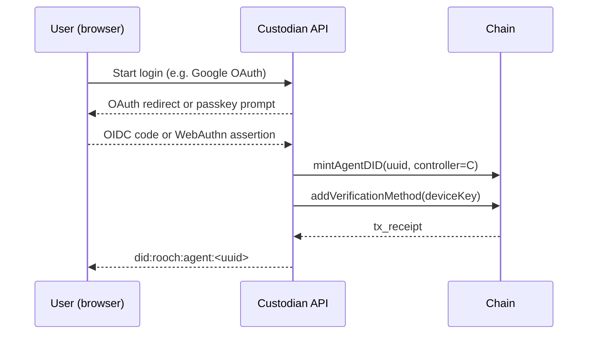

## Abstract

*NIP-3* specifies a **Custodian Registry** smart-contract interface and an off-chain **Delegated-Control Protocol** that allow Web2 users to create AI Agent DIDs without holding a wallet. A *Custodian* is an on-chain-registered service that temporarily controls the `controller` field of a freshly minted Agent DID and offers one or more Web2 authentication methods (e.g. Google OAuth, Passkey).
Users may later replace the custodian with another service or with their own wallet via a single DID-document update.

## Motivation

| Pain point | Effect | Solution offered by NIP-3 |
|------------|--------|---------------------------|
| Web2 users have **no crypto wallet** | Cannot sign the on-chain DID-creation tx | Custodian does it on their behalf |
| Ecosystem needs **multiple custodians** | Avoid vendor lock-in | Registry contract lists and ranks custodians |
| Users need to **migrate** later | Maintain DID continuity | `controller` field can be switched in one tx |

## Specification

### Custodian Registry (on-chain)

#### Data structure

On-chain, the Custodian Registry is a smart contract that maintains a list of registered custodians. Each custodian is represented by a `CustodianMeta` structure, which contains the following fields, we use Move language for the example:

```move
struct CustodianMeta has store {
    did:             String,      // The Custodian's DID, serving as the unique identifier
    name:            String,
    url:             String,      // HTTPS base URL
    auth_methods:    vector<u16>,     // Web2 login codes (see auth_methods enumeration)
    active:          bool,
    deposit:         u64              // Stake in native token
}
```

The `CustodianMeta` structure outlines the essential information stored on-chain by the Custodian Registry for each registered custodian. In this model:
1.  Custodians are identified by their DIDs (as per NIP-1), which serves as the primary key in the registry. It is **required** that a Custodian's DID document is resolvable on-chain.
2.  The Custodian's on-chain DID document, specifically through a `service` endpoint (e.g., with `type: "CustodianServiceNIP3"`), is the **primary authoritative source** for its descriptive metadata, including its `name`, `url`, supported `auth_methods`, and critically, its `verificationMethod` entries (public keys) used for authentication and other operations.
3.  The on-chain **Custodian Registry** smart-contract:
    *   Maintains a verifiable list of registered Custodians, keyed by their DIDs.
    *   Manages and provides authoritative data for registry-specific attributes: `active` status and `deposit` amount.
    *   Stores `name`, `url`, and `auth_methods` as provided by the custodian during registration or update. Custodians are responsible for ensuring this information is consistent with their DID document's service endpoint.
    *   Authenticates operations (like updates or deactivation) by verifying the transaction signer against the public keys listed in the `authentication` verification relationship of the custodian's DID document.
    *   Optionally, the registry might verify the presence and basic structure of the `CustodianServiceNIP3` service endpoint in the registered DID document during the registration process.

This approach ensures that core identity and key management adhere to DID principles (NIP-1), with the DID document being the source of truth for keys and service descriptions. The registry contract focuses on managing the lifecycle (registration, status, stake) of custodians within the ecosystem and providing a discoverable list. The `CustodianMeta` struct defined above reflects the data stored on-chain by the registry.

#### Core entry-points

| Function                                   | Description                                       |
| ------------------------------------------ | ------------------------------------------------- |
| `register(did, name, url, auth_codes)`     | Registers the custodian's `did`. Stakes ≥ `MIN_DEPOSIT`. Emits `CustodianRegistered`. Caller must be authorized by the `did`. |
| `update_meta(did, new_name, new_url, new_auth_codes)` | Updates cached metadata. Only callable by the custodian (`did`). Emits `CustodianUpdated`. |
| `deactivate(did)`                          | Voluntary quit (timelock). Only callable by the custodian (`did`). Emits `CustodianStatus`. |
| `info(did)`                                | Read-only. Returns `CustodianMeta` for the given `did`. |

> **Gas & stake amounts** are implementation-specific and *out of scope* of this draft.

#### Events

| Event                 | Payload                          |
| --------------------- | -------------------------------- |
| `CustodianRegistered` | `(did, name, url, auth_codes)`   |
| `CustodianUpdated`    | `(did, new_name, new_url, new_auth_codes)` |
| `CustodianStatus`     | `(did, active)`                  |

#### `auth_methods` enumeration

| Code  | Login method     | Protocol reference |
| ----- | ---------------- | ------------------ |
| `1`   | Google OAuth     | OIDC               |
| `2`   | Twitter OAuth    | OAuth 2            |
| `3`   | Apple Sign-In    | JWT                |
| `4`   | GitHub OAuth     | OAuth 2            |
| `5`   | Email OTP        | RFC 6120           |
| `6`   | SMS OTP          | —                  |
| `7`   | WebAuthn Passkey | FIDO2              |
| `8`   | WeChat QR        | OAuth 2            |
| `9`   | Discord OAuth    | OAuth 2            |
| `10+` | *Reserved*       | Added in future versions |

### Delegated-Control Protocol (off-chain)

#### Create Agent DID



* `deviceKey` is generated locally by the browser/SDK and **never leaves the device**.
* Custodian only holds the `controller` key.

#### Switch controller (migrate)

1. User chooses *“Self-custody”* or another custodian `C₂`.
2. Device signs migration intent `M` (`did`, new controller pubkey).
3. New custodian (or user wallet) submits `updateController(did, new_controller_pubkey)` on-chain.
4. Front-ends refresh DID cache after `ControllerChanged` event.

## Rationale

This section explains the "why" behind the design choices in the "Specification" section. It should:
*   Describe alternative designs that were considered and why they were not chosen.
*   Discuss related work or prior art.
*   Provide evidence of community consensus or address significant objections raised during discussions.

> *This draft purposefully omits gas-relay, fee, and SLA mechanics to keep the minimal viable protocol focused on **custodian discovery and Web2 authentication capability declaration**. Such extensions can be proposed in follow-up NIPs.*

## Backwards Compatibility


## Test Cases

Test cases are highly recommended for all NIPs, and mandatory for NIPs proposing changes to consensus-critical or core protocol components.
*   Provide concrete examples and expected outcomes.
*   Link to test suites if available.
<!-- TODO: Add Test Cases -->

## Reference Implementation

A reference implementation is highly recommended, and mandatory for NIPs proposing changes to consensus-critical or core protocol components.
*   Link to the reference implementation (e.g., a GitHub repository or branch).
<!-- TODO: Add Reference Implementation -->

## Security Considerations

* **Minimal trust** Custodian controls *only* `controller` key; every A2A message is still signed by user device keys (NIP-2).
* **Key rotation & exit** Custodian must allow user-initiated controller switch at any time.
* **Sybil / spam** Registry demands deposit; malicious or abandoned custodians can be de-activated by governance and forfeit stake.
* **Privacy** Auth method disclosure on-chain is limited to numeric codes; no PII stored.

## References

1. **DID Core 1.0**, W3C Recommendation
2. **OpenID Connect Core 1.0**
3. **WebAuthn Level 2**, W3C Recommendation

## Copyright

Copyright and related rights waived via [CC0](https://creativecommons.org/publicdomain/zero/1.0/).