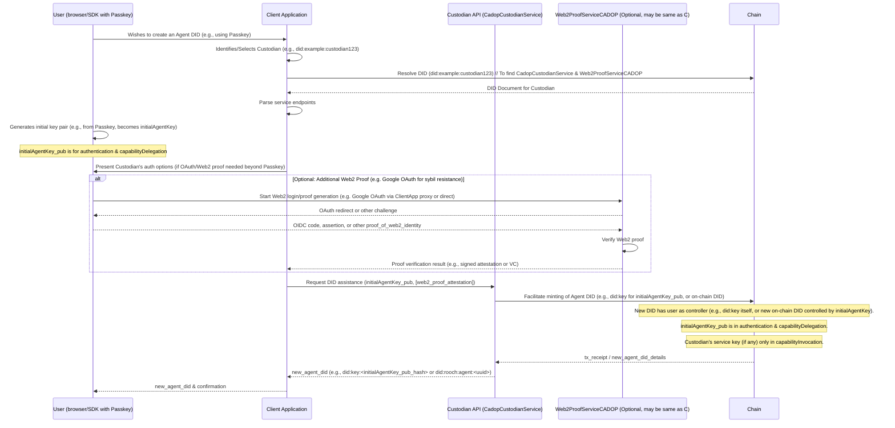

## Abstract

This Custodian-Assisted DID Onboarding Protocol (CADOP) specifies an off-chain protocol that allows Web2 users to easily create AI Agent DIDs (as defined in NIP-1), often starting with a `did:key` representation derived from a WebAuthn Passkey, without needing a traditional crypto wallet upfront. A *Custodian* is a service, discoverable via its DID document, that assists in this onboarding process and may offer related services like Web2 identity verification (e.g., via a `Web2ProofServiceCADOP`). Crucially, under CADOP, the user is the `controller` of their Agent DID from inception, holding full `capabilityDelegation` rights. The Custodian's role is purely assistive, and its operational keys are only granted `capabilityInvocation` for specific services within the user's DID document.

## Motivation

The primary goal of CADOP is to significantly lower the barrier for Web2 users to enter Web3 and AI Agent ecosystems by leveraging familiar authentication methods (like Passkeys or OAuth) while ensuring user sovereignty over their digital identity from day one.

| Pain point                                       | Effect                                                                 | Solution offered by CADOP                                                                                                                                                                                             |
| ------------------------------------------------ | ---------------------------------------------------------------------- | --------------------------------------------------------------------------------------------------------------------------------------------------------------------------------------------------------------------- |
| Web2 users often **lack crypto wallets/knowledge** | High friction for DID creation and management; cannot sign transactions. | Custodian assists with DID registration (e.g., minting a `did:key` or an on-chain DID based on user's Passkey-derived key). User's initial key gets full control (`capabilityDelegation`).                                   |
| Need for **user-controlled identity** from start   | Concerns about vendor lock-in or custodian overreach.                  | User is the `controller` of their DID from inception. Custodian keys only get `capabilityInvocation` for specific, declared services. User can revoke Custodian access or migrate their DID at any time.              |
| Desire for **progressive decentralization**      | Users might start with `did:key` but want to upgrade.                  | User's full control allows them to later update their DID document, e.g., to change the `controller` to a new on-chain DID they manage, or associate other keys/services.                                              |
| Need for **verifiable Web2 links** (optional)    | DIDs alone don't prove linkage to existing Web2 identities or attributes. | `Web2ProofServiceCADOP` allows Custodians or other services to verify Web2 information and issue attestations/VCs, which can be associated with the user's DID for enhanced trust or Sybil resistance.                  |
| Discoverability of **onboarding & proof services** | How to find trusted assistants for DID creation or Web2 verification?  | Custodian and Web2 Proof services (`CadopCustodianService`, `Web2ProofServiceCADOP`) are discoverable via their own NIP-1 compliant DID documents, enabling a competitive and decentralized ecosystem of providers. |

## Specification

### Custodian Service Declaration in DID Document

Custodians declare their services as part of their DID document (NIP-1) using the `service` property. This allows clients to discover and interact with Custodian services in a decentralized manner.

Each Custodian service endpoint in the DID document's `service` array for a `CadopCustodianService` (formerly `CustodianServiceNIP3`) MUST include:
*   `id`: A URI that conforms to the DID Core specification, typically a fragment identifier relative to the Custodian's DID (e.g., `did:example:custodian123#cadop-service`).
*   `type`: A string identifying the type of service. For CADOP Custodian services, this MUST be `CadopCustodianService`.
*   `serviceEndpoint`: A URI specifying the HTTPS base URL for the Custodian's API related to DID onboarding.
*   `metadata`: An optional JSON object containing additional information about the service, such as:
    *   `name`: (String) A human-readable name for the Custodian service.
    *   `auth_methods`: (array of u16) An array of numeric codes representing the Web2 login methods supported by the Custodian for DID onboarding assistance (see `auth_methods` enumeration below).
    *   `sybilLevel`: (Integer, 0-3) An optional integer indicating the general level of Sybil resistance or proof-of-uniqueness associated with DIDs minted via this custodian. Level 0 indicates no specific measures, while higher levels (1-3) indicate increasing stringency (e.g., Level 1: email uniqueness; Level 2: phone uniqueness; Level 3: biometric or strong government ID based proof). Specifics of these levels are informative and may be further defined by community standards or the custodian's policy.
    *   `maxDailyMints`: (Integer) An optional integer indicating a suggested or enforced maximum number of DIDs this custodian service instance might assist in minting per day, as a general operational parameter or rate-limiting indicator.

**Example DID Document Snippet for a Custodian (Illustrating `CadopCustodianService`):**

```json
{
  "@context": "https://www.w3.org/ns/did/v1",
  "id": "did:example:custodian123",
  // ... other DID document properties like verificationMethod, authentication, etc. ...
  "service": [
    {
      "id": "did:example:custodian123#cadop-service",
      "type": "CadopCustodianService",
      "serviceEndpoint": "https://custodian.example.com/api/cadop",
      "metadata": {
        "name": "Example Custodian Inc.",
        "auth_methods": [1, 7], // Supports Google OAuth and WebAuthn Passkey
        "sybilLevel": 1,
        "maxDailyMints": 1000
      }
    },
    // ... other services offered by the DID subject ...
  ]
}
```

Clients discover Custodians by resolving their DIDs and looking for service entries with `type: "CadopCustodianService"`. The `serviceEndpoint` URI is then used to interact with the Custodian's API as defined in the "Custodian-Assisted DID Onboarding Protocol".

### Web2 Proof Service Declaration (`Web2ProofServiceCADOP`)

A Custodian or other entity MAY also offer a `Web2ProofServiceCADOP`. This service is responsible for verifying Web2 claims and potentially issuing Verifiable Credentials or signed attestations that link a DID to specific Web2 identities or attributes. This service is declared in the DID document as follows:

*   `id`: A URI for the service (e.g., `did:example:custodian123#web2proof`).
*   `type`: MUST be `Web2ProofServiceCADOP`.
*   `serviceEndpoint`: A URI specifying the HTTPS base URL for the Web2 Proof Service API.
*   `metadata`: An optional JSON object containing:
    *   `name`: (String) A human-readable name for the proof service.
    *   `accepts`: (Array of Strings) An array of identifiers for the types of Web2 proofs or authentication methods it accepts as input (e.g., `"GoogleOAuthProof"`, `"TwitterOAuthProof"`, `"EmailOTPProof"`, `"PasskeyAssertion"`).
    *   `supportedClaims`: (Array of Strings) An array of claim types or Verifiable Credential types this service can issue or attest to (e.g., `"EmailVerifiedClaim"`, `"TwitterHandleClaim"`, `"AgeOver18Claim"`).

**Example DID Document Snippet for a `Web2ProofServiceCADOP`:**

```json
    {
      "id": "did:example:custodian123#web2proof",
      "type": "Web2ProofServiceCADOP",
      "serviceEndpoint": "https://custodian.example.com/api/web2proof",
      "metadata": {
        "name": "Example Web2 Proof Oracle",
        "accepts": ["GoogleOAuthProof", "PasskeyAssertion"],
        "supportedClaims": ["EmailVerifiedCredential", "PasskeyOwnershipCredential"]
      }
    }
```

### `auth_methods` enumeration

| Code  | Login method     | Protocol reference |
| ----- | ---------------- | ------------------ |
| `1`   | Google OAuth     | OIDC               |
| `2`   | Twitter OAuth    | OAuth 2            |
| `3`   | Apple Sign-In    | JWT                |
| `4`   | GitHub OAuth     | OAuth 2            |
| `5`   | Email OTP        | RFC 6120           |
| `6`   | SMS OTP          | —                  |
| `7`   | WebAuthn Passkey | FIDO2              |
| `8`   | WeChat QR        | OAuth 2            |
| `9`   | Discord OAuth    | OAuth 2            |
| `10+` | *Reserved*       | Added in future versions |

### Sybil Resistance, Proof Levels, and Quotas

To address potential Sybil attacks (where a single entity creates numerous DIDs illegitimately) and to provide varying levels of identity assurance, CADOP incorporates the concept of proof levels and operational quotas, often indicated through the Custodian's `CadopCustodianService` metadata.

*   **Proof Levels (`sybilLevel`)**: The `sybilLevel` (e.g., 0-3) in a Custodian's service metadata provides an indication of the strength of Web2 identity verification or uniqueness proofing associated with DIDs onboarded through that custodian.
    *   Level 0 typically implies minimal or no specific Sybil resistance measures beyond basic operational rate limiting.
    *   Higher levels suggest more robust checks, such as verified email (Level 1), verified phone number (Level 2), or linkage to stronger forms of identity like government-issued IDs or biometrics (Level 3, often facilitated via a `Web2ProofServiceCADOP`).
    *   These levels are primarily informative, and the exact requirements and verification methods are determined by the Custodian's policy and the capabilities of any associated `Web2ProofServiceCADOP`.
*   **Operational Quotas (`maxDailyMints`)**: The `maxDailyMints` metadata allows a Custodian to signal suggested or enforced limits on the number of DIDs it will assist in onboarding daily. This serves as a general operational parameter and a basic rate-limiting indicator, contributing to overall system stability and abuse prevention.
*   **`Web2ProofServiceCADOP` for Enhanced Proofs**: For more sophisticated Sybil resistance or to link specific Web2 claims to a DID, the `Web2ProofServiceCADOP` plays a crucial role. It can consume various Web2 authentication outputs (e.g., OAuth tokens, Passkey assertions for specific relying parties) and issue Verifiable Credentials or signed attestations. These credentials can then be associated with the user's DID, providing stronger and more specific assurances about the DID holder's identity or attributes.

While CADOP itself does not mandate specific on-chain contract internals for enforcing these, Custodians are expected to implement appropriate backend logic and policies to support their advertised `sybilLevel` and manage their operational quotas. Client applications can use this metadata to inform users or to select Custodians that meet their required level of trust or assurance.

### Delegated-Control Protocol (off-chain)

#### Discovering a Custodian
1.  The user or client application identifies a potential Custodian (e.g., through a curated list, a recommendation, or by knowing its DID).
2.  The client resolves the Custodian's DID document (NIP-1).
3.  The client parses the `service` array in the DID document, looking for an entry with `type: "CadopCustodianService"`.
4.  If found, the client uses the `serviceEndpoint` and `metadata` (like `auth_methods`) to initiate the "Create Agent DID" flow.

#### Create Agent DID



*   `initialAgentKey_pub`: The public key part of a key pair generated locally by the user's browser/SDK (e.g., derived from a WebAuthn Passkey). The private key **never leaves the user's device/Passkey environment**. This key is set up with `authentication` and `capabilityDelegation` rights on the new Agent DID.
*   The new Agent DID's `controller` is the Agent DID itself (e.g. for `did:key`) or an identifier under the user's direct control via `initialAgentKey_pub`.
*   `web2_proof_attestation` (Optional): A signed attestation or Verifiable Credential from a `Web2ProofServiceCADOP` if additional Sybil resistance or claims are part of the onboarding.
*   The Custodian (`C_DID`)'s own keys are **not** set as the `controller` and are **only** added to `capabilityInvocation` if the user's DID document needs to authorize the custodian to perform actions on its behalf for specific services.

### Permission Rules and Controller Management

This protocol establishes a user-centric permission model from the inception of the DID, diverging from scenarios where a custodian might initially hold full control.

**Key Principles for CADOP-minted DIDs:**

1.  **User as Initial Controller**: For DIDs created via CADOP, the `controller` field of the new Agent DID (which may initially be a `did:key` representation) MUST point to the Agent's own DID. The user, through their initial key (e.g., derived from a Passkey), effectively controls their own DID from the start.

2.  **User's Initial Key Permissions**: The user's initial key (e.g., the one associated with their Passkey if starting with `did:key`, or the first device key registered during the CADOP flow) MUST be added to the `verificationMethod` array of the Agent's DID document and MUST be included in both the `authentication` AND `capabilityDelegation` verification relationships.
    *   **Rationale**: This grants the user full and ultimate control over their DID, including the ability to manage other keys, services, and even change the DID's `controller` (e.g., when upgrading from a `did:key` to a different DID method or rotating their primary controlling key).

3.  **Custodian Key Permissions**: Any `verificationMethod` entries associated with the Custodian (i.e., keys controlled by the Custodian service itself, used for interacting with its declared services like `CadopCustodianService` or `Web2ProofServiceCADOP`) MUST **only** be included in the `capabilityInvocation` verification relationship in the user's Agent DID document. 
    *   **Rationale**: This strictly limits the Custodian's abilities to only invoking the specific service capabilities it has declared (e.g., responding to API calls at its `serviceEndpoint`). The Custodian CANNOT manage the user's other keys, change other verification relationships, or modify the `controller` of the user's DID.
    *   The Custodian MAY use the `expires` property for its `verificationMethod` entries in the user's DID document if its operational keys are intended to be short-lived or rotated.

4.  **Changing the `controller`**: 
    *   Since the user's key already possesses `capabilityDelegation` rights (as per point 2), any change to the `controller` field of the Agent's DID document (e.g., if migrating from a `did:key` to a different on-chain DID method that the user will control) is authorized by the user's own key, following the standard NIP-1 rules for such operations.
    *   There is no special exception needed for `authentication` keys to change the `controller` in this model, as the controlling `authentication` key is already designated with `capabilityDelegation`.

5.  **Removing Custodian Service Keys**: If a user wishes to stop using a Custodian's services, they can, using their `capabilityDelegation` rights, remove the Custodian's `verificationMethod` entry (and its reference in `capabilityInvocation`) from their DID document. This effectively revokes the Custodian's ability to interact with the user's DID via those specific service interfaces.

This model ensures that the user retains self-sovereignty over their DID at all times, while the Custodian acts as an assistant for onboarding and a provider of callable services, without holding ultimate control over the user's identity.

#### Switch controller (migrate)

Given the permission model above, where the user's primary key (e.g., derived from a Passkey) holds `capabilityDelegation` rights from the outset, the process for a user to change the `controller` of their Agent DID (for instance, when migrating from an initial `did:key` to a different DID method like `did:rooch` or another on-chain DID) follows the standard NIP-1 procedure for controller updates. This operation would be authorized by a signature from the user's key that possesses `capabilityDelegation`.

1.  The user, using their key with `capabilityDelegation` rights, decides to change the `controller` of their Agent DID to a new DID or entity they control.
2.  The user's client/SDK prepares the DID document update operation to change the `controller` field.
3.  The operation is signed by the user's key that is listed in `capabilityDelegation` (and also typically `authentication`).
4.  The signed operation is submitted to the relevant Verifiable Data Registry (VDR).
5.  The VDR verifies the signature against the current DID document. Since the key has `capabilityDelegation`, the update is authorized.
6.  The `controller` field of the Agent's DID document is updated.

If the user is also disassociating from a Custodian whose service keys were previously in `capabilityInvocation`, the user would, in a separate or combined update (authorized by their `capabilityDelegation` key), remove those service-specific `verificationMethod` entries and their references from `capabilityInvocation`.

## Rationale

The primary motivation for this NIP (now CADOP) is to lower the barrier to entry for Web2 users into the AI Agent ecosystem by abstracting away the immediate need for a crypto wallet, while ensuring user sovereignty from the outset.

**DID-based Service Discovery:**
Custodian and Web2 Proof services are declared within their own DID documents (NIP-1). This approach aligns with the decentralized ethos of DIDs and offers:
*   **Consistency:** Uses standard NIP-1 service discovery.
*   **Decentralization:** Avoids a single point of failure for service listing.
*   **Flexibility:** Service providers control their descriptions via their DID documents.
*   **Richness:** DID documents allow for extensive metadata.

**User-Centric Onboarding:**
CADOP enables users to obtain a fully self-controlled Agent DID (potentially a `did:key` initially) with assistance from a Custodian.
*   **User Control from Inception**: The user's initial key (e.g., from a Passkey) is registered with both `authentication` and `capabilityDelegation` rights, making the user the DID's `controller`.
*   **Custodian as Assistant**: The Custodian facilitates DID creation and may offer Web2 proof services. Its operational keys are only granted `capabilityInvocation` for its specific services within the user's DID document.
*   **No Vendor Lock-in**: Users fully control their DIDs and can disassociate from custodian services at any time using their `capabilityDelegation` rights.

> *This protocol focuses on custodian-assisted DID onboarding, service discovery via DID, and Web2 proof service declaration. Gas-relay, specific fee structures, and detailed SLA mechanics can be defined in separate, layered NIPs or by service providers.*

## Backwards Compatibility

This NIP defines a new protocol and service discovery mechanism. Systems not aware of `CadopCustodianService` in DID documents will not be able to discover these Custodians.

## Test Cases

Test cases are highly recommended for all NIPs.
*   **Custodian Service Discovery (`CadopCustodianService`):**
    *   Client resolves a Custodian's DID.
    *   Client successfully finds the `CadopCustodianService` entry in the `service` array.
    *   Client correctly parses `serviceEndpoint`, `auth_methods`, `sybilLevel`, and `maxDailyMints`.
    *   Client handles cases where the service entry is missing or malformed.
*   **Web2 Proof Service Discovery (`Web2ProofServiceCADOP`):**
    *   Client resolves a DID of a `Web2ProofServiceCADOP` provider.
    *   Client successfully finds the `Web2ProofServiceCADOP` entry in the `service` array.
    *   Client correctly parses `serviceEndpoint`, `accepts`, and `supportedClaims`.
*   **Agent DID Creation (via CADOP):**
    *   User initiates DID creation using an initial key mechanism (e.g., Passkey resulting in a `did:key`).
    *   Custodian (via `CadopCustodianService`) assists in minting/registering the Agent DID.
    *   The new Agent DID's `controller` field correctly points to the user's Agent DID itself.
    *   User's initial key is listed in `verificationMethod` and included in both `authentication` AND `capabilityDelegation` relationships in the new Agent's DID document.
    *   If the Custodian's service key is listed in the user's Agent DID document, it ONLY appears in `capabilityInvocation`.
    *   User successfully receives their new Agent DID.
    *   (Optional) User obtains a Web2 proof (e.g., a Verifiable Credential) from a `Web2ProofServiceCADOP`.

## Reference Implementation

<!-- TODO: Add Reference Implementation link -->

## Security Considerations

*   **User Device Key Security:** The security of the user's `deviceKey` is paramount. If compromised, an attacker could impersonate the user's Agent or attempt to change the controller. Implementations should ensure robust local key management.
*   **Custodian Trust:** Users temporarily trust the Custodian to:
    *   Correctly mint the Agent DID and set the initial `controller`.
    *   Securely handle the Web2 authentication process and any associated user data.
    *   Not censor or interfere with legitimate `updateController` requests if the Custodian is also acting as a relayer for such transactions.
    The ability to switch controllers mitigates long-term Custodian risk.
*   **DID Document Integrity:** The integrity of the Custodian's DID document is crucial for discovery. Custodians must secure their DID's `controller` keys to prevent malicious modification of their service endpoints.
*   **Privacy:**
    *   The `auth_methods` codes in the DID document are numeric and do not reveal PII.
    *   During the delegated creation process, Custodians will handle some user information related to their Web2 identity. Users should be aware of the Custodian's privacy policy. The `user_identifier_hash` aims to provide a level of pseudonymity on-chain.
*   **Phishing Custodians:** Malicious actors could set up DIDs claiming to be Custodians. Client applications may need to implement warning systems or rely on curated lists of reputable Custodians, alongside user vigilance.
*   **Passkey-based Sybil Risk**: While using WebAuthn Passkeys (often via `did:key`) for bootstrapping DIDs offers excellent usability, implementers should be aware of the potential for Sybil attacks if Passkey creation is too unconstrained. Pairing Passkey-based DID onboarding with mechanisms like proof-of-uniqueness or resource commitment, such as those that can be indicated by a Custodian-Assisted DID Onboarding Protocol (CADOP) provider (e.g., through its `sybilLevel` metadata or associated `Web2ProofServiceCADOP`), is recommended to mitigate this risk, especially for services sensitive to such attacks.
  
## References

1.  **DID Core 1.0**, W3C Recommendation
2.  **OpenID Connect Core 1.0**
3.  **WebAuthn Level 2**, W3C Recommendation
4.  **NIP-1: Agent Single DID Multi-Key Model** (Defines the DID structure and core principles)
5.  **CADOP (this document): Custodian-Assisted DID Onboarding Protocol**

## Copyright

Copyright and related rights waived via [CC0](https://creativecommons.org/publicdomain/zero/1.0/).