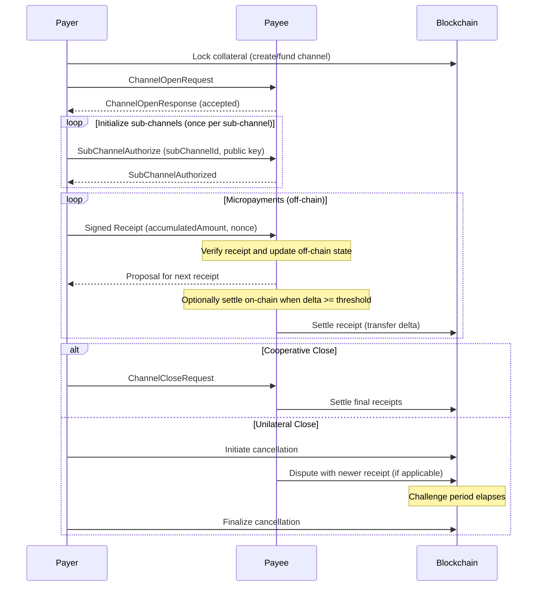

## Abstract

This NIP specifies a general-purpose **unidirectional** payment channel protocol for high-frequency, low-value micropayments between two parties.  
The protocol enables one party (the *Payer*) to lock funds on a blockchain and stream incremental payments to another party (the *Payee*) **off-chain**, using cryptographically signed **receipts** that can be settled on-chain at any time.  

To support concurrent payment flows (e.g., multi-device or multi-session scenarios), a single channel can contain multiple **sub-channels**, each maintaining independent state with monotonic nonce and accumulated amount values.  

The protocol is **ledger-agnostic**: core semantics and message structures are defined abstractly, allowing implementation on any blockchain that can enforce collateral locking, signature verification, and dispute resolution. Specific ledger bindings define concrete encoding formats, on-chain contract interfaces, and identity resolution mechanisms.

## Motivation

Protocol-level agent interactions—such as message relaying, API gateway access, or other infrastructure services—often involve high-frequency, low-value payments. Recording every payment directly on-chain is cost-prohibitive. A standard A2A payment channel enables:

* Scalable, low-cost micropayments.
* Automation friendly flows for agents acting on behalf of users.
* Interoperability across different ledgers that implement the same high-level semantics.

## Core Concepts

* **Channel** – A unidirectional payment relation (*Payer → Payee*) for a specific asset. Each channel is uniquely identified by a `channelId` deterministically derived from the payer, payee, and asset identifiers.

* **Receipt** – A cryptographically signed payment commitment containing:
  - The channel and sub-channel identifiers
  - An `accumulatedAmount` representing the total ever sent through this sub-channel
  - A monotonic `nonce` strictly increasing with each new receipt
  - The current channel `epoch` to prevent cross-reset replay attacks

* **Proposal** – An unsigned receipt generated by the payee for the next payment increment. The payer signs this proposal to create the next receipt.

* **Sub-channel** – A logical concurrent payment stream within a channel, each with independent `nonce` and `accumulatedAmount` state. Sub-channels enable multi-device or multi-session payment flows without nonce conflicts. Each sub-channel is identified by a `subChannelId`.

* **Epoch** – A channel lifecycle version number that increments each time the channel is closed and reopened. Receipts from previous epochs are rejected, preventing replay attacks after channel resets.

* **Delta** – The incremental payment amount for a receipt, computed as:  
  `delta = receipt.accumulatedAmount - lastAcceptedAmount`
  - `delta = 0`: Idempotent retry or channel initialization (no funds transferred)
  - `delta > 0`: Normal payment requiring on-chain settlement

* **Off-chain State** – The latest receipt state accepted by the payee, stored locally for verifying monotonicity of new receipts. Also referred to as `offChainLastAccepted`.

* **On-chain State** – The latest receipt state confirmed on the blockchain through settlement. Also referred to as `onChainConfirmed`. 

**Invariant**: `onChainConfirmedNonce/Amount ≤ offChainLastAcceptedNonce/Amount`

## High-Level Flow



## Data Model

### Receipt Structure

A receipt is a payment commitment containing the following logical fields:

* **version** – Protocol version number (for forward compatibility)
* **chainId** – Blockchain identifier (for cross-chain replay protection)
* **channelId** – Channel unique identifier
* **epoch** – Current channel epoch value
* **subChannelId** – Sub-channel identifier within this channel
* **accumulatedAmount** – Total amount ever sent through this sub-channel (monotonically non-decreasing)
* **nonce** – Strictly increasing counter per sub-channel (must increment by 1 for each new receipt)

**Note**: The concrete encoding of these fields (e.g., field names, data types, serialization format) is defined by implementation bindings. For example, some implementations may use `vmIdFragment` as the sub-channel identifier, while others may use different naming conventions.

### Signed Receipt

A signed receipt bundles the receipt with its cryptographic signature:

```jsonc
{
  "receipt": { /* receipt fields */ },
  "signature": "<bytes>" // signature over canonical serialization of receipt
}
```

### Canonical Serialization Requirements

Implementations MUST define:

1. **Serialization Format** – The canonical byte representation of receipts for signing (e.g., BCS, EIP-712, CBOR, or canonical JSON)

2. **Signature Algorithm** – The cryptographic algorithm(s) supported and how they map to key types (e.g., ECDSA with secp256k1/secp256r1, EdDSA with Ed25519)

3. **Key Discovery** – How verifiers obtain the public key for signature verification (e.g., via DID resolution, on-chain storage, or certificate infrastructure)

### Receipt Behavior Semantics

All receipts follow the same structure; their behavior is determined by the values and current channel state:

* **First Receipt** (`epoch=0, nonce=0, accumulatedAmount=0`): Used for lazy channel initialization. Has `delta=0`, so no funds are transferred—only the channel structure is created on-chain.

* **Payment Receipt** (`delta > 0`): Normal payment operation. The delta is settled on-chain either immediately or in batches.

* **Idempotent Retry** (`nonce` and `accumulatedAmount` equal to last accepted values): No state progression. Verifiers return success without updates.

## State Management

The protocol distinguishes between two types of state for each sub-channel:

### Off-chain State (offChainLastAccepted)

The most recent receipt state that the payee has accepted and stored locally:

* **offChainLastAcceptedNonce** – Latest nonce value accepted by payee
* **offChainLastAcceptedAmount** – Latest accumulated amount accepted by payee

This state is used for:
* Verifying monotonicity of new receipts
* Generating proposals for next receipts
* Detecting replay attempts

### On-chain State (onChainConfirmed)

The most recent receipt state that has been settled on the blockchain:

* **onChainConfirmedNonce** – Latest nonce confirmed on-chain
* **onChainConfirmedAmount** – Latest accumulated amount confirmed on-chain

This state is used for:
* Final dispute resolution
* Fund transfers
* Channel closure

### State Invariant

The following invariant MUST hold at all times:

```
onChainConfirmedNonce ≤ offChainLastAcceptedNonce
onChainConfirmedAmount ≤ offChainLastAcceptedAmount
```

This ensures that off-chain state always leads or equals on-chain state, allowing for batched settlement strategies.

## Verification Protocol

Implementations MUST perform the following verification steps when receiving a signed receipt:

### 1. Signature Validation

* Deserialize the receipt using the implementation's canonical format
* Resolve the payer's public key (e.g., via DID resolution or on-chain registry)
* Verify the signature matches the receipt payload using the appropriate algorithm
* Confirm the signing key is authorized for this sub-channel

### 2. Channel State Check

* Verify the channel exists and is in `active` state
* Verify `receipt.channelId` matches the expected channel
* Verify `receipt.epoch` matches the current channel epoch
* Reject receipts with mismatched epochs (prevents cross-reset replay)

### 3. Replay Protection and Monotonicity

For the target `(channelId, epoch, subChannelId)`:

* Retrieve `offChainLastAcceptedNonce` and `offChainLastAcceptedAmount`
* Verify `receipt.nonce > offChainLastAcceptedNonce` OR `receipt.nonce == offChainLastAcceptedNonce` (idempotent case)
* Verify `receipt.accumulatedAmount >= offChainLastAcceptedAmount`
* If both values are equal, treat as idempotent retry (no state update)

### 4. Delta Computation and Budget Validation

* Calculate `delta = receipt.accumulatedAmount - offChainLastAcceptedAmount`
* For `delta = 0`: Accept as idempotent retry or initialization; skip settlement
* For `delta > 0`: Proceed with normal payment processing
* Optionally verify `delta ≤ payer's declared maxAmount` (if supported)

### 5. State Update

If all verifications pass:

* Update `offChainLastAcceptedNonce = receipt.nonce`
* Update `offChainLastAcceptedAmount = receipt.accumulatedAmount`
* Generate proposal for next receipt (if applicable)

## Settlement Specification

Settlement is the process of confirming receipts on-chain and transferring funds. Implementations MUST support the following settlement modes:

### Lazy Channel Creation (delta = 0, first receipt)

When receiving the first receipt for a channel:

* Create the channel structure on-chain
* Lock the required collateral (amount determined by implementation)
* Initialize `onChainConfirmedNonce = 0` and `onChainConfirmedAmount = 0`
* Do NOT transfer any funds (delta is zero)

### Normal Settlement (delta > 0)

When settling a receipt with positive delta:

* Verify the receipt signature and channel state on-chain
* Ensure `receipt.nonce > onChainConfirmedNonce` (strictly increasing)
* Ensure `receipt.accumulatedAmount > onChainConfirmedAmount` (strictly increasing)
* Transfer `delta` amount from payer's locked collateral to payee
* Update `onChainConfirmedNonce = receipt.nonce`
* Update `onChainConfirmedAmount = receipt.accumulatedAmount`

### Idempotent Settlement

If a settlement transaction is submitted with `nonce` and `accumulatedAmount` equal to current on-chain state:

* Do NOT revert the transaction
* Do NOT transfer funds again
* Return success (idempotency guarantee)

### Settlement Timing Strategies

Implementations MAY choose when to trigger settlement:

* **Immediate**: Settle every receipt individually
* **Threshold-based**: Settle when `delta >= settlementThreshold`
* **Time-based**: Settle periodically (e.g., every N seconds)
* **Batched**: Aggregate multiple sub-channel receipts into one transaction
* **Manual**: Payee explicitly triggers settlement via management API

## Channel Lifecycle

### Opening a Channel

1. Payer locks collateral on-chain (via deposit or payment hub)
2. Payer sends `ChannelOpenRequest` to payee (off-chain message)
3. Payee validates and responds with `ChannelOpenResponse`
4. Payer authorizes one or more sub-channels (via `SubChannelAuthorize`)
5. Channel is ready for micropayments

### Normal Operation

1. Payer signs receipt for current payment
2. Payee verifies receipt and updates off-chain state
3. Payee generates proposal for next receipt
4. Payee optionally settles receipts on-chain (batched or threshold-based)
5. Repeat

### Cooperative Closure

1. Payer sends `ChannelCloseRequest`
2. Payee settles all pending receipts on-chain
3. Payee confirms closure (channel state becomes `closed`)
4. Remaining collateral is returned to payer

### Unilateral Closure

If the payee becomes unresponsive:

1. Payer initiates cancellation on-chain
2. Challenge period begins (implementation-defined duration)
3. Payee MAY dispute with newer receipts during challenge period
4. After challenge period expires, payer finalizes cancellation
5. Outstanding delta (if any) is transferred, remaining collateral returned to payer

## Transport Bindings

The protocol is transport-agnostic. This section provides informative guidelines for common transport profiles. Detailed specifications SHOULD be defined in separate binding documents.

### HTTP Gateway Profile (Informative)

HTTP services can support payment channels using a dedicated header (e.g., `X-Payment-Channel-Data`) to carry payment data encoded as Base64 JSON.

**Request Payload** (Payer → Payee):
```jsonc
{
  "version": <number>,              // Protocol version
  "payerId": "<identifier>",        // Optional payer identifier
  "clientTxRef": "<string>",        // Idempotency key
  "maxAmount": "<amount>",          // Optional spending limit for this request
  "signedReceipt": {                // Optional; required for paid routes
    "receipt": { /* ... */ },
    "signature": "<bytes>"
  }
}
```

**Response Payload** (Payee → Payer):
```jsonc
{
  "version": <number>,              // Protocol version
  "proposal": { /* ... */ },        // Unsigned receipt for next request
  "cost": "<amount>",               // Cost incurred for this request
  "serviceTxRef": "<string>",       // Service reference ID
  "error": {                        // Protocol-level error (if any)
    "code": "<string>",
    "message": "<string>"
  }
}
```

**Interaction Pattern**:

1. Client sends request with signed receipt (or omits for free/discovery endpoints)
2. Service verifies receipt, processes request, computes cost
3. Service generates proposal (unsigned receipt with incremented nonce and accumulated amount)
4. Service returns response with proposal in header
5. Client verifies proposal, signs it for next request

**Error Handling**:

| Condition | Recommended HTTP Status |
|-----------|-------------------------|
| Payment required / missing receipt | `402 Payment Required` |
| Invalid signature | `403 Forbidden` |
| Receipt conflict (nonce/epoch mismatch) | `409 Conflict` |
| Channel not found | `404 Not Found` |
| Malformed header | `400 Bad Request` |

### MCP Profile (Informative)

For Model Context Protocol integrations:

* Payment data is passed via tool parameters (e.g., `__nuwa_payment` field)
* Proposals are returned via MCP resource content
* Detailed specification should be defined in a separate MCP binding document

### A2A Profile (Informative)

For Agent-to-Agent messaging:

* Payment data embedded in secure DID-authenticated envelopes (per NIP-2)
* Supports both request/response and notification patterns
* Detailed specification should be defined in a separate A2A binding document

## Security Considerations

### Replay Protection

* **Epoch-based Protection**: Receipts from previous epochs are rejected after channel reset
* **Nonce Monotonicity**: Each sub-channel requires strictly increasing nonce values
* **Cross-chain Replay**: `chainId` MUST be included in the signature scope (either in-band as a receipt field, or out-of-band via signing domain)

### State Integrity

* **Off-chain/On-chain Invariant**: Implementations MUST ensure `onChainConfirmed* ≤ offChainLastAccepted*`
* **Delta Validation**: Verify computed delta does not exceed implementation-defined limits
* **Sub-channel Isolation**: Each sub-channel maintains independent nonce/amount state to prevent cross-stream conflicts

### Signature Security

* **Key Authorization**: Verify signing keys are properly authorized for the sub-channel
* **Fresh Signatures**: Consider implementing timestamp checks or TTL mechanisms to limit replay windows
* **Algorithm Agility**: Support multiple signature algorithms but enforce minimum security levels

### Denial of Service

* **Rate Limiting**: Implement appropriate rate limits for receipt verification
* **Resource Bounds**: Limit number of sub-channels per channel
* **Settlement Throttling**: Prevent spam of on-chain settlement transactions

### Asset Binding

* Asset information is implicitly bound to `channelId`
* Verifiers MUST validate asset consistency throughout channel lifecycle
* Prevent asset substitution attacks during channel operations

## Extensibility

The protocol supports evolution through:

* **Version Field**: Receipts include a version number allowing protocol upgrades
* **Implementation-Specific Extensions**: Bindings may add fields without breaking core semantics
* **Profile Mechanism**: New transport bindings can be defined independently
* **Backward Compatibility**: Newer versions should gracefully handle older receipt formats where possible

## Terminology

| Term | Definition |
|------|------------|
| **Channel** | A unidirectional payment relation (Payer → Payee) for a specific asset |
| **Receipt** | A cryptographically signed payment commitment containing channel, sub-channel, amount, and nonce information |
| **Proposal** | An unsigned receipt generated by the payee for the payer to sign, representing the next expected payment state |
| **Signed Receipt** | A receipt bundled with its cryptographic signature |
| **Sub-channel** | A logical concurrent payment stream within a channel, with independent nonce and accumulated amount |
| **Sub-channel ID** (`subChannelId`) | Identifier for a sub-channel (implementation-specific; may reference DID verification methods or other identifiers) |
| **Epoch** | Channel lifecycle version number that increments on each close/reopen cycle |
| **Nonce** | Monotonically increasing counter per sub-channel, must increment by 1 for each new receipt |
| **Accumulated Amount** | Total amount ever sent through a sub-channel since epoch began |
| **Delta** | Incremental payment amount computed as `receipt.accumulatedAmount - lastAcceptedAmount` |
| **Off-chain State** | Latest receipt state accepted by payee and stored locally (`offChainLastAccepted`) |
| **On-chain State** | Latest receipt state confirmed on blockchain through settlement (`onChainConfirmed`) |
| **Settlement** | The process of confirming a receipt on-chain and transferring funds |
| **Lazy Channel Creation** | Creating a channel on-chain using the first receipt (typically with `delta=0`) |
| **Idempotent Retry** | Submitting a receipt with values equal to the last accepted state; results in no state change |

## Appendix A: Implementation Bindings (Non-normative)

Specific blockchain implementations SHOULD provide binding documents that define:

### Required Specifications

* **Receipt Encoding** – Concrete serialization format (e.g., BCS for Move-based chains, EIP-712 for EVM, Borsh for Solana)
* **Field Mapping** – How logical receipt fields map to implementation-specific types and names
* **Signature Algorithms** – Supported cryptographic algorithms and their parameters
* **ChannelId Generation** – Rules for deriving deterministic channel identifiers
* **Sub-channel ID Format** – How sub-channels are identified (e.g., DID verification method fragments, device IDs)
* **On-chain Contract Interface** – Smart contract function signatures and behavior
* **Identity Resolution** – Mechanism for resolving payer/payee identities and public keys

### Optional Specifications

* **Payment Hub Architecture** – How collateral is managed across multiple channels
* **Multi-asset Support** – Handling multiple asset types
* **Gas Optimization** – Batching and other efficiency mechanisms
* **Challenge Period Duration** – Timing for dispute resolution

### Example Bindings

Implementation bindings may be developed for various blockchain ecosystems:

* **Move-based chains** (e.g., Rooch, Sui, Aptos): Using BCS serialization and Move module interfaces
* **EVM chains** (e.g., Ethereum, Polygon): Using EIP-712 structured signing and Solidity contracts
* **Cosmos chains**: Using IBC-compatible channel identifiers and Cosmos SDK modules
* **Solana**: Using Borsh serialization and Solana program interfaces

Each binding should be documented in a separate specification that references this core NIP-4 protocol.

## Reference Implementations

This protocol has been implemented on the Rooch blockchain with the following components:

* **Smart Contract**: [payment_channel.move](https://github.com/rooch-network/rooch/blob/main/frameworks/rooch-framework/sources/payment_channel.move) - Move-based on-chain implementation with BCS serialization and DID-based authorization
* **SDK**: [payment-kit](https://github.com/nuwa-protocol/nuwa/tree/main/nuwa-kit/typescript/packages/payment-kit) - TypeScript SDK providing client libraries, middleware, and transport adapters for HTTP and MCP protocols

These implementations demonstrate concrete bindings of the abstract protocol defined in this specification and can serve as references for implementations on other blockchains.

---

*This NIP defines the core protocol semantics for unidirectional payment channels. Implementations on specific blockchains should provide binding documents that specify concrete encoding formats, on-chain interfaces, and identity resolution mechanisms while maintaining compatibility with the abstract protocol defined herein.*
