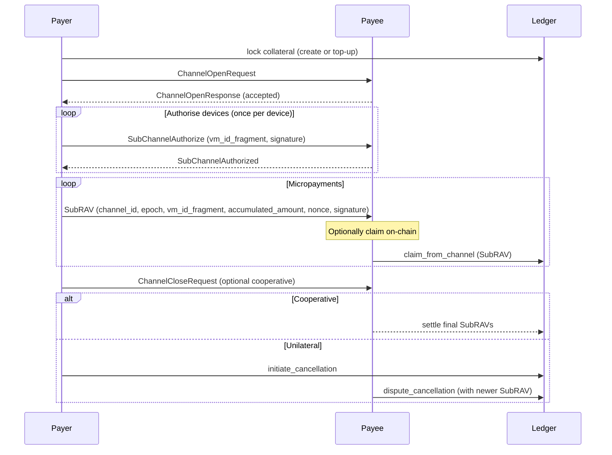

## Abstract

This NIP specifies a general-purpose **unidirectional** payment channel protocol for Agent-to-Agent (A2A) interactions.  
The protocol allows one party (the *Payer*) to lock funds on a shared ledger and stream incremental payments to another party (the *Payee*) **off-chain**, using cryptographically signed receipts that can be settled on-chain at any time.  
To support multi-device or multi-session scenarios, a single channel can contain multiple **Sub-Channels**, each tied to a specific verification method of the Payer’s DID.  
The design is ledger-agnostic: an accompanying smart-contract or on-chain program is required on the chosen chain, but the messages and flows defined here do **not** mandate any Rooch-specific constructs.

## Motivation

Protocol-level agent interactions—such as message relaying, API gateway access, or other infrastructure services—often involve high-frequency, low-value payments. Recording every payment directly on-chain is cost-prohibitive. A standard A2A payment channel enables:

* Scalable, low-cost micropayments.
* Automation friendly flows for agents acting on behalf of users.
* Interoperability across different ledgers that implement the same high-level semantics.

## Terminology

* **Ledger** – Any blockchain or state channel network capable of enforcing locked collateral and dispute resolution.
* **Payer Agent** – Agent that funds the channel and signs payment receipts.
* **Payee Agent** – Agent that receives payments and can redeem receipts on-chain.
* **Payment Hub (optional)** – A user-controlled pot that holds collateral for *many* channels and *many* assets.  Specific ledgers MAY expose this optimisation; it is NOT required by the protocol.
* **Payment Channel** – Unidirectional relation *Payer ➜ Payee* for one asset.
* **Sub-Channel** – Logical stream inside a Payment Channel, bound to one verification method of the Payer’s DID (e.g., a device key).  Each Sub-Channel has its own nonce & running total.
* **Receipt / Voucher (SubRAV)** – Off-chain message signed by the Payer that carries the **accumulated** amount sent through one Sub-Channel plus a monotonic `nonce`.
* **Channel Epoch** – Integer that increments every time the whole channel is closed and reopened, preventing old receipts from being replayed after a reset.

## High-Level Flow



## Data Structures

### SubRAV (Sub-channel Receipt And Voucher)

```jsonc
{
  "chainId"           : "<uint64>   # identifies ledger instance>", 
  "channelId"         : "<bytes32>  # deterministic id derived from payer+payee+asset>",
  "channelEpoch"      : "<uint64>   # prevents replay across resets>",
  "vmIdFragment"      : "<string>   # DID verification method fragment (e.g. 'key-1')>",
  "accumulatedAmount" : "<uint256>  # total ever sent in this sub-channel>",
  "nonce"             : "<uint64>   # strictly increasing per sub-channel>",
  // NOTE: the signature is transmitted separately; see next section.
}
```

### SignedSubRAV

When transporting proofs off-chain it is convenient to bundle the payload and its signature.

```jsonc
{
  "subRav": { /* see SubRAV */ },
  "signature": "<bytes>" // signature produced according to method_type
}
```

This object is called **SignedSubRAV**.  Protocol messages and HTTP headers SHOULD embed a `signedSubRav` field rather than two separate sibling fields.  Smart-contracts, however, still receive `(subRav, signature)` as separate parameters for gas efficiency.

Ledger contracts receive the **SubRAV payload** *plus* a separate `signature` parameter. They MUST verify:

1. `chainId` matches the current chain;
2. `channelEpoch` equals the on-chain epoch for `channelId`;
3. `accumulatedAmount ≥ last_claimed_amount` and `nonce ≥ last_confirmed_nonce` stored on-chain;
4. `signature` is valid over the canonical serialization of the SubRAV payload, using the **public key and type** recorded when the Sub-Channel was authorised.

### Canonical Serialization & Signature

To avoid implementation-dependent ambiguities, the following rules apply when signing or verifying a SubRAV:

1. **Serialization** – The SubRAV payload (JSON shown above) is serialized using **BCS** (Binary Canonical Serialization).  Other ledgers MAY adopt CBOR or their own canonical JSON, but MUST specify it in their profile.  The Rooch reference implementation uses `bcs::to_bytes(SubRAV)`.
2. **Signature Algorithm & Hashing** – Determined by the `method_type` recorded at sub-channel authorisation time (e.g., `EcdsaSecp256k1VerificationKey2019`, `Ed25519VerificationKey2018`).  Some algorithms (ECDSA) hash the message internally (Keccak-256/ SHA-256) while others (Ed25519) sign the raw bytes.  **Signers MUST feed the canonical bytes directly into their crypto library and MUST NOT double-hash.**
3. **Verification** – The verifier receives `(bytes, signature, method_type)` and invokes the crypto routine that matches `method_type`.  The routine itself decides whether to hash internally.

Pseudocode (off-chain):

```typescript
const bytes = bcsSerialize(subRavPayload);
const signature = signWithMethodType(key, methodType, bytes); // library hashes internally if required
```

`signature` is transported alongside the payload.

#### Rooch Reference Mapping

For clarity, the Rooch DID module currently applies the following defaults when `signWithMethodType` is invoked:

| method_type | Curve | Hash applied before signature |
|-------------|-------|--------------------------------|
| `EcdsaSecp256k1VerificationKey2019` | secp256k1 | **SHA-256** |
| `EcdsaSecp256r1VerificationKey2019` | secp256r1 | **SHA-256** |
| `Ed25519VerificationKey2018` | ed25519 | internal SHA-512 (handled by Ed25519 alg) |

Implementations on other ledgers MUST document any deviation from these defaults.

### On-Chain Contract Expectations (non-normative)

An implementation **should** expose entry points equivalent to:

* `open_channel(asset, payer, payee)` – creates or re-activates a channel.
* `authorize_sub_channel(channel_id, vm_id_fragment, public_key, method_type)` – stores key metadata.
* `claim_from_channel(channel_id, vm_id_fragment, SubRAV)` – pulls funds from collateral to Payee.
* `close_channel(channel_id, final_SubRAVs[])` – cooperative close.
* `initiate_cancellation(channel_id, baseline_SubRAVs[])` / `dispute_cancellation(...)` / `finalize_cancellation(channel_id)` – unilateral close with challenge period.

Details such as **Payment Hub**, multi-asset support, or how collateral is stored are left to each ledger.

## Profile Placeholders (to be split into separate NIPs)

The specification above defines the **core ledger-agnostic rules**. Concrete integrations will be standardised in separate "profile" documents that extend this core with transport-specific messaging, headers, or RPCs.

Planned profiles include (subject to separate NIP drafts):

* **A2A Profile** – secure DID-authenticated envelopes (a preliminary version is embedded in this document for convenience).
* **HTTP Gateway Profile** – `X-Payment-Channel-Data` header semantics, HTTP status codes, etc.
* **MCP Profile** – binary framing for model-communication-protocol streams.
* **WebSocket / gRPC Profile** – low-latency streaming scenarios.

Additional profiles can be proposed by the community without changing the core.

## Protocol Messages

Messages use the secure A2A envelope defined in NIP-2.  They are ledger-agnostic.

### 1. `ChannelOpenRequest` (Payer ➜ Payee)

```jsonc
{
  "type"                : "ChannelOpenRequest",
  "proposedChannelId"   : "...",   // deterministic suggestion by Payer
  "payerDid"            : "did:example:payer",
  "payeeDid"            : "did:example:payee",
  "asset"               : { "symbol": "RGAS", "chainId": 4 },
  "initialCollateral"   : "1000"   // as string for uint256
}
```

### 2. `ChannelOpenResponse` (Payee ➜ Payer)

```jsonc
{
  "type"        : "ChannelOpenResponse",
  "channelId"   : "...",          // may echo proposed id or choose another
  "status"      : "accepted"|"rejected"|"alternative_proposed",
  "asset"       : { "symbol": "RGAS", "chainId": 4 },
  "message"     : "..."
}
```

### 3. `SubChannelAuthorize` (Payer ➜ Payee)

Authorises a **verification method** to act as a Sub-Channel.

```jsonc
{
  "type"             : "SubChannelAuthorize",
  "channelId"        : "...",
  "vmIdFragment"     : "key-1",
  "publicKeyMultibase": "...",
  "methodType"       : "EcdsaSecp256k1VerificationKey2019",
  "signature"        : "sig(payer) over canonical json"
}
```

The Payee validates that the key indeed belongs to the Payer's DID and stores the metadata off-chain; it is later provided to the ledger when first claimed.

### 4. `SubRAV` (Payer ➜ Payee)

Carries the payment itself. Structure identical to the JSON above minus the comments.

### 5. `ChannelCloseRequest` & `ChannelCloseConfirmation`

Unchanged from earlier draft, except that `final_signed_state` is now **an array of SubRAVs**, one per active Sub-Channel.

### 6. Optional Notifications

Implementations MAY define auxiliary messages, for example `ChannelClaimNotification` (Payee ➜ Payer) once an on-chain claim succeeds, or heartbeat pings.

## HTTP Gateway Profile (draft)

Services that do not speak native A2A can still leverage payment channels via a single HTTP header `X-Payment-Channel-Data` carrying Base64-encoded JSON.  The pattern is:

1. Client adds latest signed **SubRAV** (and optionally a *max_acceptable_amount*) in the *request* header.
2. Service verifies the SubRAV, processes the request, decides the cost, **increments `accumulated_amount`**, signs the new SubRAV, and returns it in the *response* header.
3. Client stores the response SubRAV and sends it back as the next request’s header, forming an ACK loop similar to A2A messages.  The Service can batch on-chain claims arbitrarily.

### Header Definition & Reference IDs

`X-Payment-Channel-Data`: Base-64 encoded UTF-8 JSON. The header **MUST** appear at most once per HTTP message.

`clientTxRef` / `serviceTxRef` are **off-chain transaction references** for this *HTTP request–response* pair:

* **clientTxRef** – (optional) identifier generated by the client to make the request idempotent on retries.
* **serviceTxRef** – (optional) identifier generated by the service so the client can correlate logs/billing data.

They are **not** on-chain transaction hashes，nor do they appear inside `SubRAV`.  Implementations MAY omit them if idempotency/audit is handled elsewhere.

### Request Payload (Client → Service)

```jsonc
{
  "channelId"  : "<bytes32>",                // REQUIRED – the target channel
  "signedSubRav" : { ... },                 // REQUIRED – latest Payer-signed SubRAV acknowledged by client
  "maxAmount"     : "<uint256>",            // OPTIONAL – spending limit the client is willing to accept for this request
  "clientTxRef"  : "<string>",             // OPTIONAL – idempotency key for client
  "confirmationData": {                      // OPTIONAL – client signature over a proposal received in prev response
    "subRav" : { ... },                      //   REQUIRED – Payee-proposed SubRAV to be confirmed
    "signatureConfirmer": "<bytes>"         //   REQUIRED – Payer signature over the proposal
  }
}
```

### Response Payload (Service → Client)

```jsonc
{
  "signedSubRav"   : { ... },               // REQUIRED – Payee-proposed next SubRAV (accumulatedAmount incremented)
  "amountDebited"   : "<uint256>",          // REQUIRED – delta applied for this HTTP transaction
  "serviceTxRef"   : "<string>",           // OPTIONAL – reference id on provider side
  "errorCode"       : 0,                     // OPTIONAL – non-zero if request failed but still billed
  "message"          : "..."                 // OPTIONAL – human-readable info
}
```

### Mandatory Verification Steps

* Service **MUST** validate `subRav` signature and that `accumulatedAmount ≥ previous_claimed`.
* Client **MUST** validate Payee signature in response before storing the new `subRav`.
* Both parties **SHOULD** use HTTPS/TLS; the header is not confidential but prevents MITM tampering.

### Error Handling

| Condition | Recommended HTTP Status |
|-----------|------------------------|
| Payment required / insufficient credit | **402 Payment Required** |
| Invalid header / malformed JSON | **400 Bad Request** |
| Signature verification failed | **403 Forbidden** |

### Example Exchange

```text
Client Request 1:
GET /v1/images HTTP/1.1
Host: api.example.com
X-Payment-Channel-Data: eyAiY2hhbm5lbF9pZCI6ICIweDEyYW..."  // base64(json)

Service Response 1:
200 OK
X-Payment-Channel-Data: eyAic3ViX3Jhd..."  // Payee-signed proposal

// Client verifies, signs confirmation inside next request:

Client Request 2 (with confirmation of state N):
GET /v1/images?page=2 HTTP/1.1
X-Payment-Channel-Data: eyAiY2hhbm5lbF..."  // contains confirmation_data + new max_amount
```

#### Decoded JSON Samples

Below is an illustrative set of header payloads **before** Base-64 encoding.  Numbers are expressed as strings to keep JSON unambiguous.

Client → Service (Request #1):

```json
{
  "channelId": "0x35df6e58502089ed640382c477e4b6f99e5e90d881678d37ed774a737fd3797c",
  "signedSubRav": {
    "subRav": {
      "chainId": 4,
      "channelId": "0x35df6e58502089ed640382c477e4b6f99e5e90d881678d37ed774a737fd3797c",
      "channelEpoch": 0,
      "vmIdFragment": "account-key",
      "accumulatedAmount": "100000000000000000",  // 0.1 RGAS
      "nonce": 5
    },
    "signature": "0x9c520eeef94d4c69912619d2a34358c106cd6f941b67316208470116227e095728a0ae48..."
  },
  "maxAmount": "5000000000000000",              // willing to spend up to 0.005 RGAS this call
  "clientTxRef": "client-req-007"
}
```

Service → Client (Response #1):

```json
{
  "signedSubRav": {
    "subRav": {
      "chainId": 4,
      "channelId": "0x35df6e58502089ed640382c477e4b6f99e5e90d881678d37ed774a737fd3797c",
      "channelEpoch": 0,
      "vmIdFragment": "account-key",
      "accumulatedAmount": "105000000000000000",  // +0.005 RGAS
      "nonce": 6
    },
    "signature": "0xa0ae489d9430fda5751e6c6b0c1fef01568db18a0da97450031fd59a768aa7..."
  },
  "amountDebited": "5000000000000000",
  "serviceTxRef": "srv-resp-456",
  "message": "Charged 0.005 RGAS"
}
```

Client → Service (Request #2) would include a `confirmationData` field containing the **exact** `subRav` received above plus the Payer's confirmation signature.

### Settlement Strategy

The Service may choose when to submit accumulated SubRAVs on-chain.  High-frequency providers usually:

1. Aggregate until `accumulatedAmount - last_claimed ≥ threshold` **or** a timer elapses.
2. Call `claim_from_channel` with the latest SubRAV.

### Security Notes

* **Replay protection** — `clientTxRef`/`serviceTxRef` SHOULD be logged to detect duplicate HTTP operations.
* **Header size** — Implementations should compress JSON (e.g., remove whitespace) and be mindful of typical 8-16 KB header limits.
* **Clock skew** — Not relevant; nonce monotonicity is sufficient.

### Optional Management Endpoints (non-normative)

The header-only pattern is sufficient for metered billing, yet many gateways find it useful to expose auxiliary REST routes for observability and graceful operations.  The following endpoints are **recommended but not mandatory**:

| Method | Path | Purpose |
|--------|------|---------|
| `GET` | `/payment-channel/{channelId}/status` | Return latest `accumulatedAmount`, remaining collateral estimate, last `serviceTxRef`, and channel status. |
| `POST` | `/payment-channel/{channelId}/close` | Cooperatively close the channel: server returns final SubRAV list for on-chain settlement; may require auth. |
| `GET` | `/payment-channel/{channelId}/claims` | Paginated list of on-chain `claim_from_channel` transactions already submitted by the gateway. |
| `POST` | `/payment-channel/{channelId}/top-up` | Optional helper to validate a new on-chain deposit and refresh collateral figures. |

Design notes:

* All endpoints **MUST** be protected by the same authentication mechanism used for the business API (e.g., DID-derived HTTP signatures).
* Responses SHOULD embed a canonical JSON SubRAV when relevant, so the client can verify server claims.
* The exact URI scheme is illustrative; gRPC or GraphQL bindings can offer equivalent functionality.

#### JSON Examples

```jsonc
// GET /payment-channel/0xABCD/status  → 200 OK
{
  "channelId": "0xABCD",
  "accumulatedAmount": "420000000000000000",   // total paid so far
  "remainingCollateral": "580000000000000000", // still locked in hub
  "lastServiceTxRef": "srv-resp-789",
  "status": "ACTIVE",
  "channelEpoch": 0,
  "subChannelCount": 3
}

// GET /payment-channel/0xABCD/claims?page=1  → 200 OK
{
  "claims": [
    {
      "txHash": "0x99ff...",
      "vmIdFragment": "account-key",
      "amount": "5000000000000000",
      "nonce": 6,
      "timestampMs": 1710678123456
    }
  ],
  "nextPage": null
}

// POST /payment-channel/0xABCD/close  → 200 OK
{
  "finalSubRavs": [
    { "subRav": { /* ... */ }, "signature": "0x..." },
    { "subRav": { /* ... */ }, "signature": "0x..." }
  ],
  "totalToSettle": "420000000000000000",
  "message": "Submit the above array via claim_from_channel to settle."
}

// POST /payment-channel/0xABCD/top-up  (body: {"txHash": "0xDEAD", "amount": "100000000000000000"})
// → 202 Accepted
{
  "verified": true,
  "newCollateral": "680000000000000000"
}
```

---

*This NIP is led by the requirements of existing open-source implementations yet remains flexible enough for other ledgers to adopt by supplying compatible on-chain logic.*
